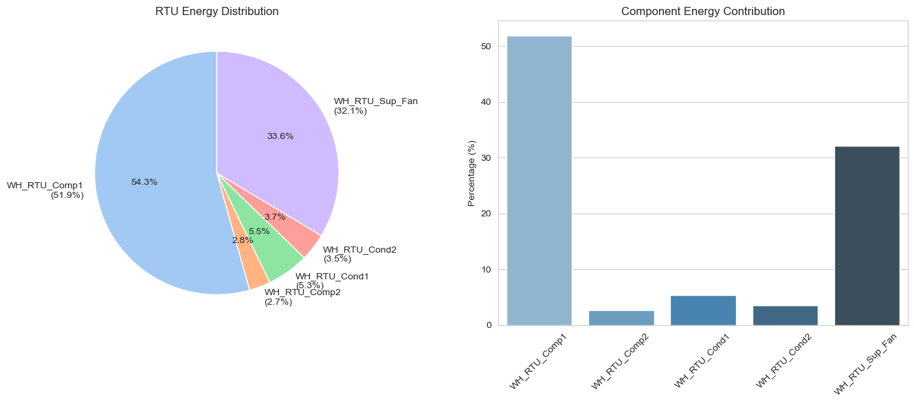
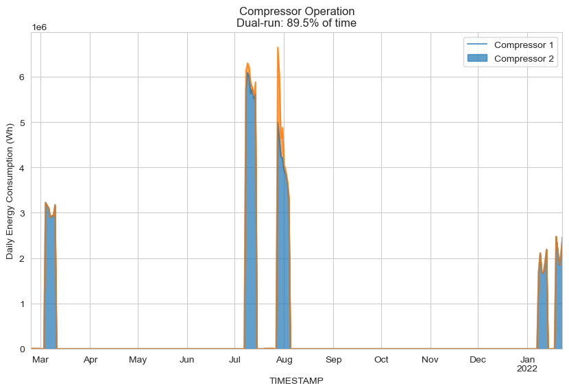
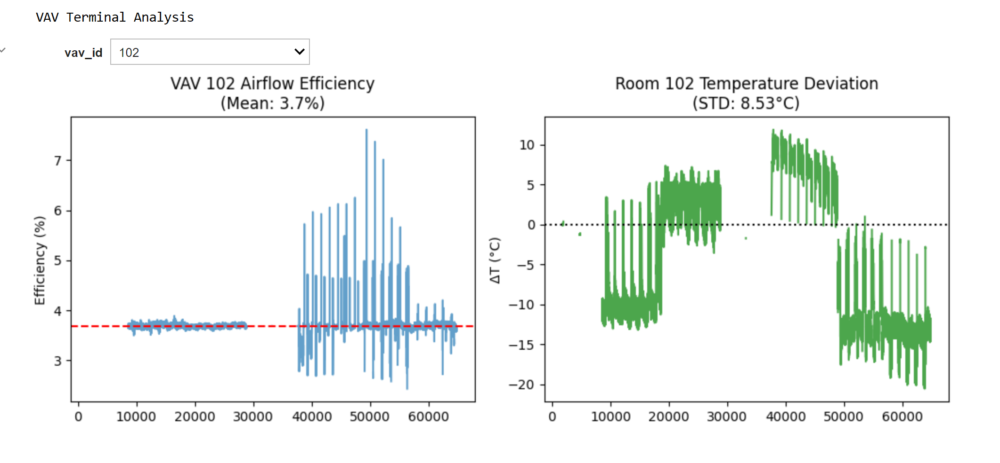
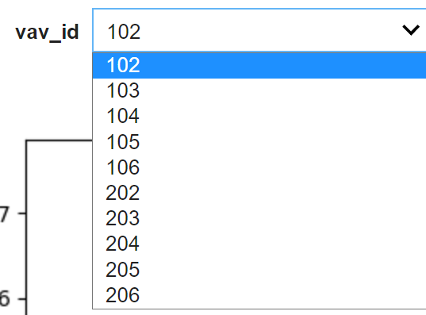
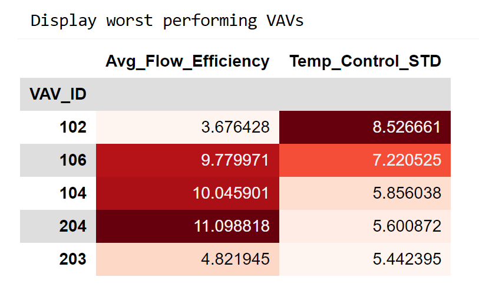
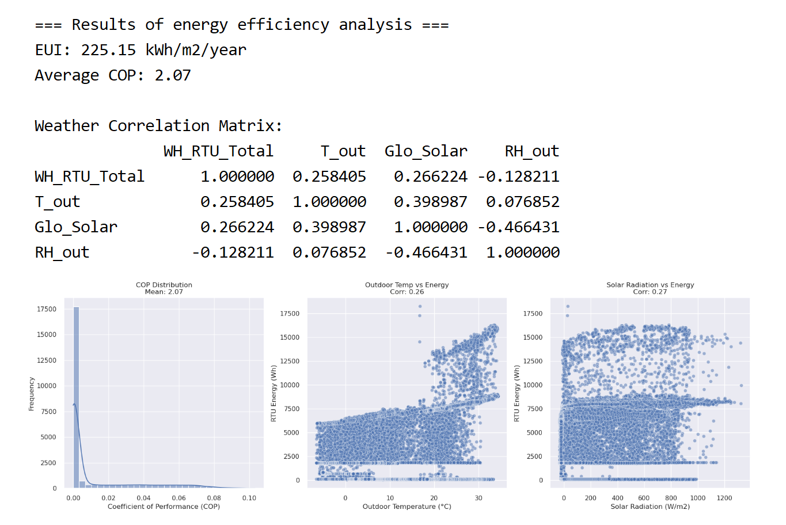
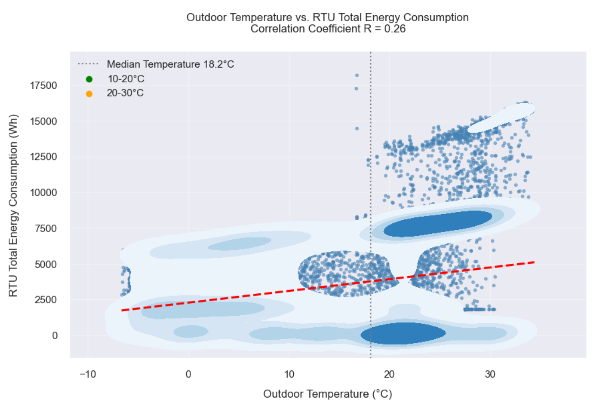
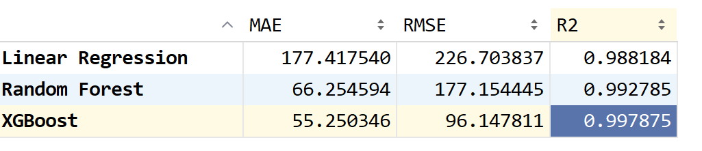
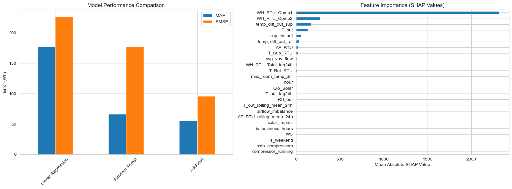
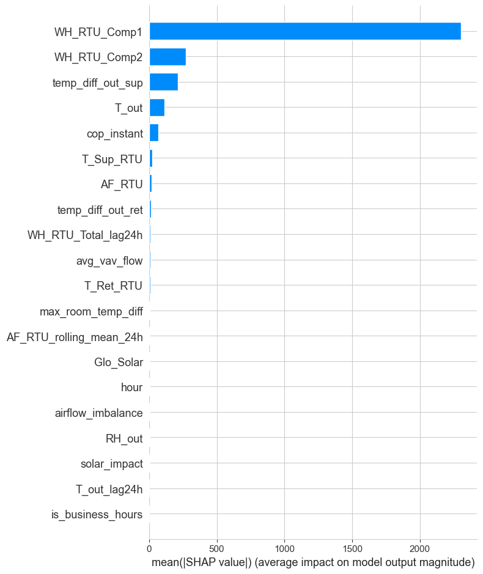

# HVAC Final Project Check In

**Authors**: Weiqi (Vicky) Dong, Yuchen (Olivia) Kuang  
**Date**: 2025-04-03

---
## Project Goal
Simulate the core intelligence of Elipsa’s HVAC  tool — identifying rooftop-terminal unit (RTU–VAV) system structure and diagnosing inefficiencies or abnormal performance using data.

---
## Data Overview

### Primary Dataset: `HVAC_NewData`

- **RTUs**:  
  Files like `RTU_1.csv`, `RTU_2.csv`, `RTU_3.csv` represent rooftop units.
  - Key fields: `SuplAirTemp`, `HtgPct`, `SuplFanSpd`

- **VAVs**:  
  Files like `A.csv` to `ZZ.csv` represent terminal units.
  - Key fields: `DschAirTemp`, `HtgPct`, `AirFlow`, `RmTemp`, `ClgPct`, etc.

> ⚠️ The `HVAC` folder (zone-level data) is excluded per company clarification — it's outdated, lacks mapping, and is not recommended for main analysis.
---

## 1. RTU Activity Status

### Goal

Determine which RTUs are active and serving loads.

### Approach

- Analyzed:
- `SuplAirTemp` trends
  
- `HtgPct` heating percentage
  
- `SuplFanSpd` fan output
  

### Result

| RTU   | Active? | Notes                             |
|-------|---------|-----------------------------------|
| RTU_1 | ✅ Yes  | Heating/Cooling cycles visible     |
| RTU_2 | ✅ Yes  | Actively modulating temperature    |
| RTU_3 | ❌ No   | Mostly inactive, excluded from mapping |

---

## 2. RTU–VAV Connection Mapping

### What we want to know:

Which RTU serves each VAV?

---

### Version 1 – Simple Matching (Baseline)

- Matched `DschAirTemp` (VAV) ↔ `SuplAirTemp` (RTU)
- Metrics:
  - Pearson correlation
  - Mean Squared Error (MSE)

---

### Version 2 – Enhanced Matching (Improved)

Added new VAV–RTU signals:
- `HtgPct` (heating behavior similarity)
- `AirFlow` vs `HtgPct` (response linkage)

### Composite Scoring Formula:
```python
CombinedScore = Corr_Temp - MSE_Temp + Corr_HtgPct + Corr_AirFlow_HtgPct
```

| Using Metric         | Meaning                                          |
|----------------------|--------------------------------------------------|
| `Corr_Temp`          | Correlation between discharge air & supply air  |
| `MSE_Temp`           | Dsch-Supl temperature mismatch (penalty)        |
| `Corr_HtgPct`        | Synchronized heating activation                 |
| `Corr_AirFlow_HtgPct`| Terminal airflow responding to RTU heating      |


> This version achieved 100% connection resolution across 47+ VAVs.


### RTU VAVS Connections Result Visualization:
Sankey:


Network:


## 3. Processing of HVAC folder
### (1). Data Integration and Cleaning
* Goal: 

  Process and merge HVAC-related data into a cleaned dataset HVAC_cleaned_data.csv.

* Approach:
  
  Load metadata from building and weather information CSV files.
  
  Merge multiple building and weather data files, handling duplicates and standardizing timestamps.
  
  Convert TIMESTAMP column to datetime format.
  
  Clean data by preprocessing special values, handling missing data (interpolation for numeric columns, specific values for text), and detecting outliers using the Z-score method.
  
  Save the cleaned dataset for further analysis.

### (2)Component-Level Analysis
* Goal: 
 Conduct an in-depth component-level analysis of the HVAC system.

* Approach:

  RTU Components: Calculate energy distribution and visualize results using pie charts and bar plots.
  
  Compressors: Compare runtime and simultaneous operation using a stacked area plot.
  
  VAV Terminals: Evaluate airflow efficiency and temperature control.

* Results:

  Performance metrics and interactive visualizations for each component.

* Generated Images:

  
  
  
  
    

  

### (3)System-Level Energy Efficiency Analysis
* Goal: 

  Assess system-level HVAC energy efficiency.

* Approach:

  Calculate key metrics such as Energy Use Intensity (EUI), Coefficient of Performance (COP), and weather correlations.
  
  Compare EUI values against industry benchmarks.
  
  Analyze COP statistics.
  
  Study weather-energy correlations through temperature-energy and solar radiation-energy scatter plots.

* Results:

  Energy efficiency insights with corresponding visualizations.

* Generated Images:

  
  

### (4)Machine Learning-Based HVAC Energy Prediction
* Goal: 

  Implement an ML-based HVAC energy prediction pipeline.

* Approach:

  Perform feature engineering to create relevant features.
  
  Train baseline models including linear regression, random forest, and XGBoost.
  
  Evaluate model performance.
  
  Identify key features influencing HVAC energy consumption using SHAP values.

* Results:

  Model performance metrics.
  
  Feature importance analysis.

  * Generated Images:
  
  
  
---

## 4. Todo List
| Task | Description |
|------|-------------|
| **Basic Statistics** | Compute average AirFlow, DschAirTemp, and DmprPos |
| | Analyze Room_Temperature_Diff and VAV_Temperature_Diff |
| | Identify outliers and anomalies using boxplots and 3σ rule |
| **Energy Efficiency** | Calculate Energy Use Intensity (EUI) |
| | Compare EUI across units |
| | Evaluate airflow efficiency and temperature control accuracy |
| **Pattern Recognition** | Analyze occupancy-based energy differences |
| | Detect simultaneous heating and cooling issues |
| | Assess damper position and airflow relationships |
| **Correlation Analysis** | Compute correlation matrix |
| | Analyze key factors affecting energy consumption |
| **Clustering Analysis** | Perform clustering on EUI, airflow, and temperature control |
| | Identify abnormal clusters |
| **Time Series Analysis** | Detect energy patterns by hour, day, and season |
| | Identify unnecessary energy usage during off-hours |
| **Issue Detection** | Detect leakage, refrigerant, and dirty coil issues |
| | Estimate energy losses and savings potential |
| **Report Preparation** | Create dashboards and heatmaps |
| | Write recommendations and validate findings |

